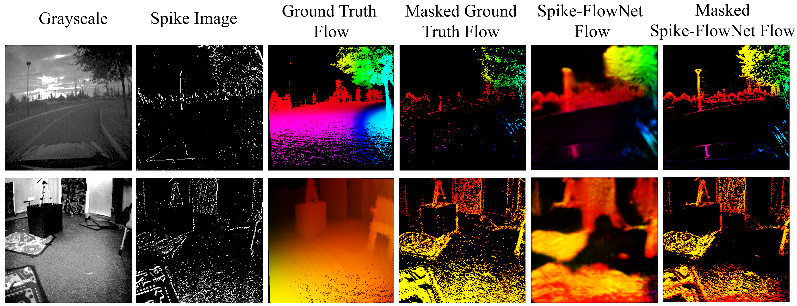

# Spike-FlowNet: Event-based Optical Flow Estimation with Energy-Efficient Hybrid Neural Networks


  

This repository contains the source code associated with [Spike-FlowNet: Event-based Optical Flow Estimation with Energy-Efficient Hybrid Neural Networks, ECCV 2020](https://link.springer.com/chapter/10.1007/978-3-030-58526-6_22). This code has most recently been tested with Python 3.7 and Pytorch 1.1.0.


## Introduction
Event-based cameras display great potential for a variety of tasks such as high-speed motion detection and navigation in low-light environments where conventional frame-based cameras suffer critically. This is attributed to their high temporal resolution, high dynamic range, and low-power consumption. However, conventional computer vision methods as well as deep Analog Neural Networks (ANNs) are not suited to work well with the asynchronous and discrete nature of event camera outputs. Spiking Neural Networks (SNNs) serve as ideal paradigms to handle event camera outputs, but deep SNNs suffer in terms of performance due to spike vanishing phenomenon. To overcome these issues, we present Spike-FlowNet, a deep hybrid neural network architecture integrating SNNs and ANNs for efficiently estimating optical flow from sparse event camera outputs without sacrificing the performance. The network is end-to-end trained with self-supervised learning on Multi-Vehicle Stereo Event Camera (MVSEC) dataset. Spike-FlowNet outperforms its corresponding ANN-based method in terms of the optical flow prediction capability while providing significant computational efficiency.


## Installation
Clone this repository using: 
```git clone https://github.com/chan8972/Spike-FlowNet.git```

Create a conda environment using the [environment.yml](environment.yml) file: 
```conda env create -f environment.yml```

Activate the conda environment: 
```conda activate spikeflownet```


## Dataset

The data for the ```outdoor_day``` and ```indoor_flying``` sequences can be found [__**here**__](https://daniilidis-group.github.io/mvsec/download/#hdf5-files). 

Ground truth flow computed from the paper can also be downloaded [__**here**__](https://drive.google.com/drive/folders/1XS0AQTuCwUaWOmtjyJWRHkbXjj_igJLp?usp=sharing).

Download the ```*_data.hdf5``` and ```*_gt.hdf5``` files from the above link in their respective folders inside the [/datasets](datasets).

Example: Download ```indoor_flying1_data.hdf5``` and ```indoor_flying1_gt.hdf5``` files into [/datasets/indoor_flying1](datasets/indoor_flying1) folder.

Convert the hdf5 files into encoded format using [/encoding/split_coding.py](encoding/split_coding.py).


## Training

The basic syntax is:

For ```dt=1``` : ```python3 main_spike_flow_dt1.py```

For ```dt=4``` :  ```python3 main_spike_flow_dt4.py```


## Pre-trained Model

The pretrained models for ```dt=1``` and ```dt=4``` can be found in [/pretrain](pretrain/) folder. Note, pretrained models are trained only on outdoor_day2 dataset as described in the paper.


## Testing with flow visualization

The basic syntax is:

For ```dt=1``` : ```python3 main_spike_flow_dt1.py --evaluate --pretrained='checkpoint_path' --render``` 

For ```dt=4``` : ```python3 main_spike_flow_dt4.py --evaluate --pretrained='checkpoint_path' --render```


## Some useful Command-line arguments 

```--data``` : specifies the dataset folder [/datasets](datasets/)

```--savedir``` : folder for saving training results

```--workers``` : number of workers to use

```--render``` : render flow outputs while evaluating

```--evaluate-interval``` : how many epochs to evaluate after

```--pretrained``` : path to pretrained model

Other available command line arguments for hyperparameter tuning can be found in the ```main_spike_flow_dt*.py``` files.


## Citations

If you find this code useful in your research, please consider citing:
[Lee C., Kosta A.K., Zhu A.Z., Chaney K., Daniilidis K., Roy K. "Spike-FlowNet: Event-Based Optical Flow Estimation with Energy-Efficient Hybrid Neural Networks.", In Proceedings of the European Conference on Computer Vision (ECCV) 2020](https://link.springer.com/chapter/10.1007/978-3-030-58526-6_22)

```
@inproceedings{10.1007/978-3-030-58526-6_22,
  title={Spike-FlowNet: Event-based Optical Flow Estimation with Energy-Efficient Hybrid Neural Networks},
  author={Lee, Chankyu and Kosta, Adarsh and Zhu, Alex Zihao and Chaney, Kenneth and Daniilidis, Kostas and Roy, Kaushik},
  booktitle={European Conference on Computer Vision},
  pages={366--382},
  year={2020},
  organization={Springer}
}
```

An arXiv version is also available: 
[Chankyu Lee, Adarsh Kumar Kosta, Alex Zihao Zhu, Kenneth Chaney, Kostas Daniilidis and Kaushik Roy, "Spike-FlowNet: Event-based Optical Flow Estimation with Energy-Efficient Hybrid Neural Networks", arXiv preprint, 2020](https://arxiv.org/abs/2003.06696)

```
@article{lee2020spike,
  title={Spike-FlowNet: Event-based Optical Flow Estimation with Energy-Efficient Hybrid Neural Networks},
  author={Lee, Chankyu and Kosta, Adarsh and Zhu, Alex Zihao and Chaney, Kenneth and Daniilidis, Kostas and Roy, Kaushik},
  journal={arXiv preprint arXiv:2003.06696},
  year={2020}
}
```

## Authors

Chankyu Lee, Adarsh Kumar Kosta, Alex Zihao Zhu, Kenneth Chaney, Kostas Daniilidis and Kaushik Roy.

-A collaboration of the [C-BRIC](https://engineering.purdue.edu/C-BRIC) teams from Purdue University and University of Pennsylvania.


## Acknowledgments

Parts of this code were derived from [daniilidis-group/EV-FlowNet](https://github.com/daniilidis-group/EV-FlowNet) and [ClementPinard/FlowNetPytorch](https://github.com/ClementPinard/FlowNetPytorch).
